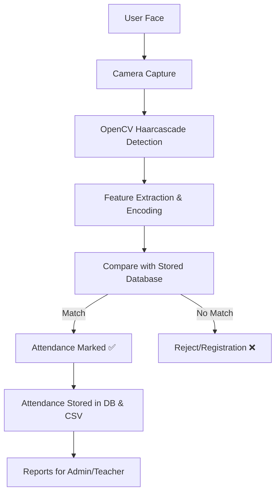

# 🎓 Smart Attendance System (Face Recognition-Based)

[](https://www.python.org/) 
[](https://flask.palletsprojects.com/) 
[](https://opencv.org/) 
[](https://www.sqlite.org/) 
[](LICENSE)

---

## 📖 Project Overview
The **Smart Attendance System** is a **Face Recognition-Based Attendance Tracker** designed for educational institutions and workplaces.  
It automates the process of marking attendance by recognizing faces in real-time and securely logging them in a database.

### 🔑 Key Benefits
- Contactless & hygienic 👋  
- Prevents **proxy/buddy attendance** 🚫  
- Real-time data storage & reporting 📊  
- Secure, scalable & cloud-ready ☁️  

---

## ⚡ System Workflow



---

## ✨ Features
- 👨‍🏫 **Role-Based Access** → Admin, Teacher, Student  
- 📷 **Real-Time Face Detection & Recognition**  
- 📂 **Automated Attendance Logging** (DB + CSV)  
- 📊 **Downloadable Reports** (Daily/Weekly/Monthly)  
- 📱 **Responsive Web UI** with Flask + Bootstrap  
- 🔒 **Secure Authentication** with hashed passwords  
- ☁️ **Cloud-ready Deployment**  

---

## 🛠️ Tech Stack
**Frontend:** HTML5, CSS3, JavaScript, Bootstrap  
**Backend:** Python (Flask Framework)  
**Libraries:** OpenCV, NumPy, Pickle, bcrypt  
**Database:** SQLite (default) | MySQL (scalable)  
**Tools:** Git, Heroku/Railway/AWS for deployment  

---

## 📂 Project Structure
```
FaceRecognitionAttendanceSystem/
│
├── app.py                         # Main Flask app
├── schema.sql                     # Database schema
├── attendance.db                  # SQLite database
│
├── /Attendance/                   # Attendance CSV reports
│   └── Attendance_YYYY-MM-DD.csv
│
├── /data/                         # Saved facial data
│   ├── faces_data.pkl
│   ├── names.pkl
│   └── settings.pkl
│
├── /static/                       # Static files (CSS, images)
│   ├── css/style.css
│   └── bg.png
│
├── /templates/                    # HTML Templates
│   ├── index.html
│   ├── login.html
│   ├── dashboard.html
│   ├── capture.html
│   ├── recognize.html
│   ├── attendance.html
│   └── settings.html
│
└── haarcascade_frontalface_default.xml  # Face detection model
```

---

## ⚙️ Installation & Setup

### 🔧 Prerequisites
- Python 3.8+  
- Webcam/Camera  
- SQLite (default)  

### 📥 Step 1: Clone Repository
```bash
git clone https://github.com/themanishpndt/Face-Recognition-Attendance-System.git
cd Face-Recognition-Attendance-System
```

### 🛠️ Step 2: Create Virtual Environment
```bash
python -m venv venv
venv\Scriptsctivate   # Windows
source venv/bin/activate # Mac/Linux
```

### 📦 Step 3: Install Dependencies
```bash
pip install -r requirements.txt
```

### 🗄️ Step 4: Setup Database
```bash
sqlite3 attendance.db < schema.sql
```

### ▶️ Step 5: Run Application
```bash
python app.py
```

### 🌐 Step 6: Access in Browser
```
http://127.0.0.1:5000/
```

---

## 📊 Attendance Report Format
Example CSV Report:  
```
Student_ID, Name, Date, Time, Status
101, Rahul Sharma, 2025-09-11, 09:05, Present
102, Priya Singh, 2025-09-11, 09:07, Present
103, Manish Sharma, 2025-09-11, 09:10, Present
```

---

## 🔒 Security Features
- Password hashing (bcrypt) 🔑  
- Role-based access control 🧑‍💻  
- Input validation & CSRF protection 🛡️  
- Data encryption for facial embeddings 🔐  
- Logging & monitoring for admin audit 📜  

---

## 🧪 Testing
- ✅ **Unit Testing** → Individual modules  
- 🔄 **Integration Testing** → Face recognition + DB + UI  
- 🌐 **System Testing** → End-to-end workflow  
- 🐞 **Debugging Report** maintained  

---

## 📜 Limitations
- Requires good lighting conditions 💡  
- Accuracy decreases with poor camera quality 📷  
- Limited by hardware performance ⚙️  
- Privacy/legal concerns around biometric data ⚖️  

---

## 🔮 Future Enhancements
- 📱 Mobile app (Android/iOS) integration  
- 🌐 Cloud database (Firebase/AWS RDS)  
- 🤖 AI-based engagement & emotion detection  
- 🔑 Multi-Factor Authentication (Face + OTP)  
- 🎯 Integration with IoT smart classrooms  

---

## 📌 Applications
- 🏫 Schools & Colleges → Student attendance  
- 🏢 Offices → Employee time tracking  
- 🎤 Events → Entry management  
- 🏥 Healthcare → Staff attendance logging  
- 🛂 Security → Access control in sensitive areas  

---

## 👨‍💻 Author

**Manish Sharma**  
📍 Ghaziabad, Uttar Pradesh, India  
📞 +91 7982682852  
📧 [manishsharma93155@gmail.com](mailto:manishsharma93155@gmail.com)  
🔗 [LinkedIn](https://www.linkedin.com/in/themanishpndt)  
💻 [GitHub](https://github.com/themanishpndt)  
🌐 [Portfolio](https://themanishpndt.github.io/Portfolio/)  

---

## 📜 License
This project is licensed under the **MIT License** – feel free to use, modify, and distribute with proper attribution.  

---

## ⭐ Contributing
Contributions, issues, and feature requests are welcome!  

1. Fork the repo  
2. Create your feature branch (`git checkout -b feature-name`)  
3. Commit changes (`git commit -m 'Added new feature'`)  
4. Push branch (`git push origin feature-name`)  
5. Open Pull Request  

If you like this project, **please ⭐ the repository** 🙌  
