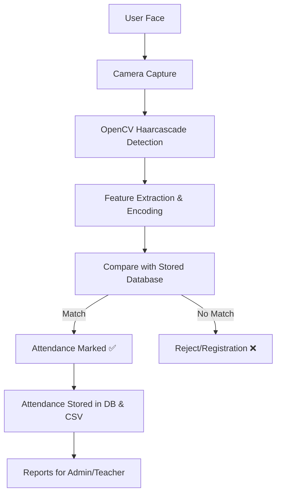

# 🎓 Smart Attendance System — Face Recognition-Based Attendance Tracker

[](https://www.python.org/)
[](https://flask.palletsprojects.com/)
[](https://opencv.org/)
[](https://www.sqlite.org/)
[](LICENSE)

A production-ready, self-hosted face recognition attendance system built with Flask and OpenCV. Mark attendance in real-time using a webcam, manage users, and export reports – all through a clean web interface.

---

## 📌 Overview

The **Smart Attendance System** automates attendance tracking using face recognition. It is designed for educational institutions and workplaces to replace manual roll calls and prevent proxy attendance.

- **Contactless & hygienic**
- **Real‑time logging** (SQLite + daily CSV)
- **Role‑based access** (Admin / Teacher / Student)
- **Extensible & cloud‑ready**

---

## ✨ Key Features

- 👨‍🏫 **Role‑Based Access** – Different dashboards and permissions for Admin, Teacher, and Student.
- 📷 **Face Capture & Registration** – Enroll users via webcam; face embeddings stored locally.
- 🔍 **Real‑Time Recognition** – Live camera feed matches faces and marks attendance.
- 📂 **Dual Attendance Storage** – Logs saved in SQLite and as daily CSV files (under `Attendance/`).
- 📊 **Exportable Reports** – Download attendance as CSV/Excel (daily/weekly/monthly).
- 🔒 **Secure Authentication** – Passwords hashed (bcrypt recommended), session management.
- 🌐 **Responsive Web UI** – Built with Bootstrap, custom CSS/JS.

---

## ⚙️ System Workflow



---

## 🛠️ Tech Stack

| Area        | Technologies                                                                 |
|-------------|------------------------------------------------------------------------------|
| Frontend    | HTML5, CSS3, JavaScript, Bootstrap 4, Font Awesome                           |
| Backend     | Python 3.8+, Flask, Jinja2 templates                                         |
| ML / CV     | OpenCV (Haar cascade), custom face encoding + distance matching              |
| Database    | SQLite (default) – tables: `teachers`, `classes`, `attendance_records`, etc. |
| Persistence | Pickle files (`faces_data.pkl`, `names.pkl`, `settings.pkl`) in `data/`      |
| DevOps      | Gunicorn, Nginx, Docker (optional), environment variables via `.env`         |

---

## 📁 Project Structure

```
Smart Attendence System/
│
├── app.py                         # Main Flask application
├── schema.sql                     # Database schema (create tables)
├── attendance.db                  # SQLite database (auto‑created)
├── haarcascade_frontalface_default.xml  # Face detection model
├── requirements.txt               # Python dependencies
├── README.md                      # This file
│
├── Attendance/                    # Daily CSV attendance logs
│   ├── Attendance_07-02-2026.csv
│   └── ...
│
├── data/                          # Pickled face data & settings
│   ├── faces_data.pkl
│   ├── names.pkl
│   ├── face_recognizer.pkl        # Optional trained model
│   ├── settings.pkl
│   └── today_attendance_*.csv
│
├── static/                        # Static assets
│   ├── css/                       # animations.css, capture.css, main.css
│   └── js/                        # capture.js, dashboard.js, main.js
│
└── templates/                      # Jinja2 HTML templates
    ├── base.html
    ├── index.html
    ├── capture.html
    ├── recognize.html
    ├── attendance.html
    ├── export_attendance.html
    ├── manage_users.html
    ├── settings.html
    ├── error.html
    ├── auth/
    │   ├── login.html
    │   └── register.html
    └── teacher/
        ├── dashboard.html
        ├── classes.html
        └── student_attendance.html
```

---

## 🗄️ Database Schema (Key Tables)

**teachers**  
| Column        | Type      | Description                |
|---------------|-----------|----------------------------|
| id            | INTEGER   | PK, autoincrement          |
| username      | TEXT      | Unique login name          |
| password_hash | TEXT      | Hashed password            |
| email         | TEXT      | Unique email               |
| full_name     | TEXT      | Display name               |
| created_at    | TIMESTAMP | Registration time          |

**classes**  
| Column      | Type      | Description                |
|-------------|-----------|----------------------------|
| id          | INTEGER   | PK                         |
| teacher_id  | INTEGER   | FK → teachers.id           |
| name        | TEXT      | Class name                 |
| description | TEXT      |                            |
| created_at  | TIMESTAMP |                            |

**attendance_records**  
| Column       | Type      | Description                |
|--------------|-----------|----------------------------|
| id           | INTEGER   | PK                         |
| student_name | TEXT      | Name from users table      |
| class_id     | INTEGER   | FK → classes.id            |
| teacher_id   | INTEGER   | FK → teachers.id           |
| date         | TEXT      | DD-MM-YYYY                 |
| time         | TEXT      | HH:MM:SS                   |
| status       | TEXT      | 'Present' / 'Absent'       |
| notes        | TEXT      | Optional                   |

**users** (face recognition users)  
| Column     | Type      | Description                |
|------------|-----------|----------------------------|
| username   | TEXT      | PK                         |
| name       | TEXT      | Full name                  |
| email      | TEXT      |                            |
| user_id    | TEXT      | Unique ID (e.g., roll no)  |
| department | TEXT      |                            |
| phone      | TEXT      |                            |
| role       | TEXT      | student/teacher            |
| notes      | TEXT      |                            |
| created_at | TIMESTAMP |                            |

---

## 🔧 Installation & Setup

### Prerequisites
- Python 3.8+
- Webcam
- Git
- Virtual environment (recommended)

### Step 1: Clone the Repository
```bash
git clone https://github.com/themanishpndt/Face-Recognition-Attendance-System.git
cd Face-Recognition-Attendance-System
```

### Step 2: Create and Activate Virtual Environment
**Windows (PowerShell)**
```powershell
python -m venv venv
venv\Scripts\Activate
```
**macOS / Linux**
```bash
python3 -m venv venv
source venv/bin/activate
```

### Step 3: Install Dependencies
```bash
pip install -r requirements.txt
```

### Step 4: Initialize the Database
```bash
sqlite3 attendance.db < schema.sql
```

### Step 5: Run the Application
```bash
python app.py
```
or
```bash
flask run
```

### Step 6: Access the Web Interface
Open your browser and go to:  
[http://127.0.0.1:5000](http://127.0.0.1:5000)

---

## 🚀 Usage

1. **Register an account** (Teacher/Admin) via `/register`.
2. **Log in** and create classes (if teacher/admin).
3. **Enroll students** using the `/capture` page – capture multiple face samples.
4. **Mark attendance** via `/recognize` – the live camera will identify faces and log them.
5. **View reports** under `/attendance` and export as CSV from `/export_attendance`.

---

## 🔐 Security Considerations

- Passwords are hashed (bcrypt recommended; check `app.py` for exact method).
- Session-based authentication with Flask.
- Role-based access control on routes.
- **For production:**
  - Replace SQLite with a managed database (PostgreSQL).
  - Move face embeddings to encrypted storage.
  - Use HTTPS (TLS) via Nginx reverse proxy.
  - Set `SECRET_KEY` as a strong environment variable.
  - Implement CSRF protection (Flask-WTF).

---

## 📈 Future Enhancements

- Upgrade to deep learning embeddings (FaceNet / ArcFace) for higher accuracy.
- Add anti‑spoofing (liveness detection).
- Build a mobile app (Android/iOS) with on‑device recognition.
- Integrate with school MIS / HR systems.
- Deploy as microservices with dedicated recognition workers.
- Store embeddings in a vector database (FAISS, Milvus) for fast similarity search.

---

## 📜 License

This project is licensed under the **MIT License** – see the [LICENSE](LICENSE) file for details.

---

## 🤝 Contributing

Contributions, issues, and feature requests are welcome!

1. Fork the repository.
2. Create your feature branch: `git checkout -b feature/amazing-feature`
3. Commit your changes: `git commit -m 'Add amazing feature'`
4. Push to the branch: `git push origin feature/amazing-feature`
5. Open a Pull Request.

Please ensure your code adheres to the existing style and includes tests where appropriate.

---

## 👨‍💻 Author

**Manish Sharma**  
📍 Ghaziabad, Uttar Pradesh, India  
📞 +91 7982682852  
📧 [manishsharma93155@gmail.com](mailto:manishsharma93155@gmail.com)  
🔗 [LinkedIn](https://www.linkedin.com/in/themanishpndt)  
💻 [GitHub](https://github.com/themanishpndt)  
🌐 [Portfolio](https://themanishpndt.github.io/Portfolio/)

---

If you like this project, please ⭐ the repository on GitHub! 🙌