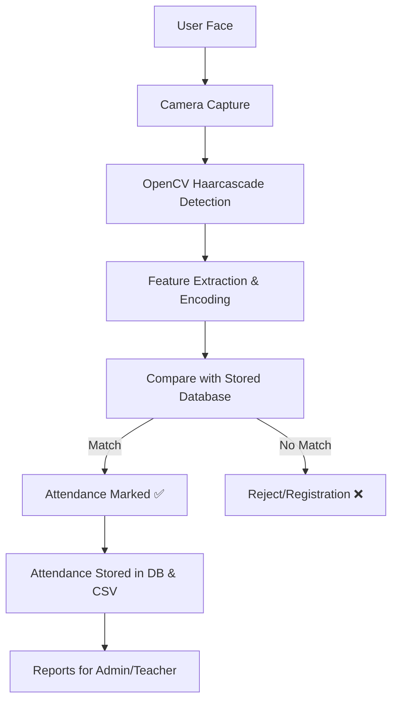

# 🎓 Smart Attendance System (Face Recognition-Based)

[](https://www.python.org/) 
[](https://flask.palletsprojects.com/) 
[](https://opencv.org/) 
[](https://www.sqlite.org/) 
[](LICENSE)

---

## 📖 Project Overview
The **Smart Attendance System** is a **Face Recognition-Based Attendance Tracker** designed for educational institutions and workplaces.  
It automates the process of marking attendance by recognizing faces in real-time and securely logging them in a database.

### 🔑 Key Benefits
- Contactless & hygienic 👋  
- Prevents **proxy/buddy attendance** 🚫  
- Real-time data storage & reporting 📊  
- Secure, scalable & cloud-ready ☁️  

---

## ⚡ System Workflow



---

## ✨ Features
- 👨‍🏫 **Role-Based Access** → Admin, Teacher, Student  
- 📷 **Real-Time Face Detection & Recognition**  
- 📂 **Automated Attendance Logging** (DB + CSV)  
- 📊 **Downloadable Reports** (Daily/Weekly/Monthly)  
- 📱 **Responsive Web UI** with Flask + Bootstrap  
- 🔒 **Secure Authentication** with hashed passwords  
- ☁️ **Cloud-ready Deployment**  

---

## 🛠️ Tech Stack
**Frontend:** HTML5, CSS3, JavaScript, Bootstrap  
**Backend:** Python (Flask Framework)  
**Libraries:** OpenCV, NumPy, Pickle, bcrypt  
**Database:** SQLite (default) | MySQL (scalable)  
**Tools:** Git, Heroku/Railway/AWS for deployment  

---

## 📂 Project Structure

```
Smart Attendence System/
│
├── app.py                         # Main Flask app (Flask, OpenCV, DB, API)
├── schema.sql                     # Database schema (all tables)
├── attendance.db                  # SQLite database (auto-created)
├── db.sqlite3                     # (Legacy/alternate DB)
├── haarcascade_frontalface_default .xml # Face detection model
├── requirements.txt               # Python dependencies
├── README.md                      # Project documentation
│
├── /Attendance/                   # Attendance CSV reports (per day)
│   ├── Attendance_07-02-2026.csv
│   ├── Attendance_11-07-2025.csv
│   ├── ...
│
├── /data/                         # Saved facial data & settings
│   ├── faces_data.pkl             # Encoded face data
│   ├── names.pkl                  # List of registered user names
│   ├── face_recognizer.pkl        # Trained face recognizer (KNN/SVM)
│   ├── settings.pkl               # System settings (camera, thresholds)
│   └── today_attendance_26-04-2025.csv
│
├── /static/                       # Static files (CSS, JS, images)
│   ├── bg.png
│   ├── /css/
│   │   ├── animations.css
│   │   ├── capture.css
│   │   └── main.css
│   └── /js/
│       ├── capture.js
│       ├── dashboard.js
│       └── main.js
│
├── /templates/                    # Jinja2 HTML Templates
│   ├── base.html                  # Main layout
│   ├── index.html                 # Landing page
│   ├── error.html                 # Error display
│   ├── capture.html               # Face registration
│   ├── recognize.html             # Face recognition
│   ├── result.html                # Result/success page
│   ├── instructions.html          # Help/instructions
│   ├── manage_users.html          # User management (admin/teacher)
│   ├── attendance.html            # Attendance dashboard
│   ├── settings.html              # System settings
│   ├── export_attendance.html     # Export reports
│   ├── /auth/
│   │   ├── login.html             # Login page
│   │   └── register.html          # Registration page
│   └── /teacher/
│       ├── dashboard.html
│       ├── attendance.html
│       ├── classes.html
│       ├── class_detail.html
│       ├── student_attendance.html
│       └── {{ url_for('manage_classes') }}
│
├── /clean_repo/                   # (For code cleanup/archival)
└── .git/, .venv/                  # Git and virtual environment folders
```

---

## 🗄️ Database Schema (SQLite)

### teachers
| Field        | Type      | Description                |
|--------------|-----------|----------------------------|
| id           | INTEGER   | Primary key, autoincrement |
| username     | TEXT      | Unique, login name         |
| password_hash| TEXT      | Hashed password (SHA256)   |
| email        | TEXT      | Unique email               |
| full_name    | TEXT      | Display name               |
| created_at   | TIMESTAMP | Registration time          |

### classes
| Field        | Type      | Description                |
|--------------|-----------|----------------------------|
| id           | INTEGER   | Primary key, autoincrement |
| teacher_id   | INTEGER   | FK to teachers(id)         |
| name         | TEXT      | Class name                 |
| description  | TEXT      | Class description          |
| created_at   | TIMESTAMP | Creation time              |

### class_students
| Field        | Type      | Description                |
|--------------|-----------|----------------------------|
| class_id     | INTEGER   | FK to classes(id)          |
| student_name | TEXT      | Name of student            |
| added_at     | TIMESTAMP | When added                 |

### attendance_records
| Field        | Type      | Description                |
|--------------|-----------|----------------------------|
| id           | INTEGER   | Primary key, autoincrement |
| student_name | TEXT      | Name of student            |
| class_id     | INTEGER   | FK to classes(id)          |
| teacher_id   | INTEGER   | FK to teachers(id)         |
| date         | TEXT      | Date (DD-MM-YYYY)          |
| time         | TEXT      | Time (HH:MM:SS)            |
| status       | TEXT      | Present/Absent             |
| notes        | TEXT      | Optional notes             |

### users (Face Recognition Users)
| Field        | Type      | Description                |
|--------------|-----------|----------------------------|
| username     | TEXT      | Primary key                |
| name         | TEXT      | Full name                  |
| email        | TEXT      | Email address              |
| user_id      | TEXT      | Unique user ID             |
| department   | TEXT      | Department/branch          |
| phone        | TEXT      | Phone number               |
| role         | TEXT      | Role (student/teacher)     |
| notes        | TEXT      | Extra notes                |
| created_at   | TIMESTAMP | Registration time          |

---

## 🖥️ Enhanced UI/UX & Backend Integration

- All pages use modern, responsive layouts (Bootstrap 4, custom CSS, Font Awesome)
- Card-based dashboards for users, attendance, and settings
- Real-time statistics and data visualizations
- Live search, filtering, and export (CSV, Excel, PDF, JSON)
- Flash messages for all actions (success, error, info)
- Secure authentication (SHA256 password hashing, session management)
- All data flows through Flask backend (Jinja2 templates, REST API endpoints)
- Database queries for all user, attendance, and class data
- All forms have client-side and server-side validation
- Modular static assets: `/static/css/`, `/static/js/`
- All facial data and settings stored in `/data/` (Pickle format)
- Attendance records stored in both SQLite and daily CSVs

---

## 🔄 Data Flow & Major Features

1. **Face Registration:**
    - User registers face via webcam (capture.html)
    - Images encoded, stored in `/data/faces_data.pkl` and `/data/names.pkl`
    - User details saved in `users` table

2. **Attendance Marking:**
    - User recognized in real-time (recognize.html)
    - Attendance logged in `attendance_records` and `/Attendance/Attendance_*.csv`

3. **User Management:**
    - Admin/teacher can view, search, and delete users (manage_users.html)
    - All user info shown from database

4. **Statistics Dashboard:**
    - Attendance page shows total records, unique users, today's count
    - Export page shows live stats and allows report download

5. **Settings:**
    - Camera, face sample count, recognition threshold, notifications
    - All settings saved in `/data/settings.pkl`

6. **Authentication:**
    - Login/register with hashed passwords (SHA256)
    - Role-based access for teachers/admins

---

## 📈 Example Data Flow

1. User registers face → Data saved in `/data/` and `users` table
2. User recognized → Attendance saved in `attendance_records` and `/Attendance/`
3. Admin views dashboard → Data loaded from DB, shown in cards/tables
4. Export triggered → CSV/Excel/PDF generated from DB, downloaded

---

---

## ⚙️ Installation & Setup

### 🔧 Prerequisites
- Python 3.8+  
- Webcam/Camera  
- SQLite (default)  

### 📥 Step 1: Clone Repository
```bash
git clone https://github.com/themanishpndt/Face-Recognition-Attendance-System.git
cd Face-Recognition-Attendance-System
```

### 🛠️ Step 2: Create Virtual Environment
```bash
python -m venv venv
venv\Scriptsctivate   # Windows
source venv/bin/activate # Mac/Linux
```

### 📦 Step 3: Install Dependencies
```bash
pip install -r requirements.txt
```

### 🗄️ Step 4: Setup Database
```bash
sqlite3 attendance.db < schema.sql
```

### ▶️ Step 5: Run Application
```bash
python app.py
```

### 🌐 Step 6: Access in Browser
```
http://127.0.0.1:5000/
```

---

## 📊 Attendance Report Format
Example CSV Report:  
```
Student_ID, Name, Date, Time, Status
101, Rahul Sharma, 2025-09-11, 09:05, Present
102, Priya Singh, 2025-09-11, 09:07, Present
103, Manish Sharma, 2025-09-11, 09:10, Present
```

---

## 🔒 Security Features
- Password hashing (bcrypt) 🔑  
- Role-based access control 🧑‍💻  
- Input validation & CSRF protection 🛡️  
- Data encryption for facial embeddings 🔐  
- Logging & monitoring for admin audit 📜  

---

## 🧪 Testing
- ✅ **Unit Testing** → Individual modules  
- 🔄 **Integration Testing** → Face recognition + DB + UI  
- 🌐 **System Testing** → End-to-end workflow  
- 🐞 **Debugging Report** maintained  

---

## 📜 Limitations
- Requires good lighting conditions 💡  
- Accuracy decreases with poor camera quality 📷  
- Limited by hardware performance ⚙️  
- Privacy/legal concerns around biometric data ⚖️  

---

## 🔮 Future Enhancements
- 📱 Mobile app (Android/iOS) integration  
- 🌐 Cloud database (Firebase/AWS RDS)  
- 🤖 AI-based engagement & emotion detection  
- 🔑 Multi-Factor Authentication (Face + OTP)  
- 🎯 Integration with IoT smart classrooms  

---

## 📌 Applications
- 🏫 Schools & Colleges → Student attendance  
- 🏢 Offices → Employee time tracking  
- 🎤 Events → Entry management  
- 🏥 Healthcare → Staff attendance logging  
- 🛂 Security → Access control in sensitive areas  

---

## 👨‍💻 Author

**Manish Sharma**  
📍 Ghaziabad, Uttar Pradesh, India  
📞 +91 7982682852  
📧 [manishsharma93155@gmail.com](mailto:manishsharma93155@gmail.com)  
🔗 [LinkedIn](https://www.linkedin.com/in/themanishpndt)  
💻 [GitHub](https://github.com/themanishpndt)  
🌐 [Portfolio](https://themanishpndt.github.io/Portfolio/)  

---

## 📜 License
This project is licensed under the **MIT License** – feel free to use, modify, and distribute with proper attribution.  

---

## ⭐ Contributing
Contributions, issues, and feature requests are welcome!  

1. Fork the repo  
2. Create your feature branch (`git checkout -b feature-name`)  
3. Commit changes (`git commit -m 'Added new feature'`)  
4. Push branch (`git push origin feature-name`)  
5. Open Pull Request  

If you like this project, **please ⭐ the repository** 🙌  
