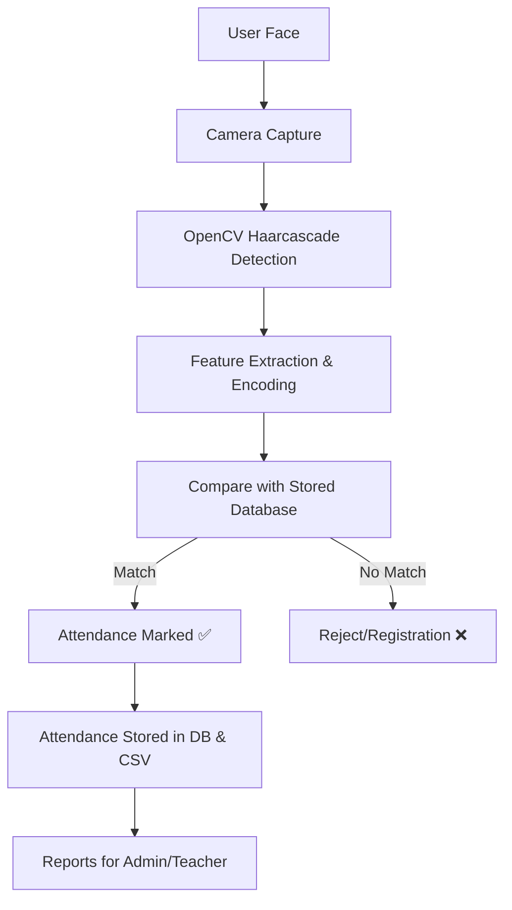

# 🎓 Smart Attendance System — Face Recognition-Based Attendance Tracker

[](https://www.python.org/)
[](https://flask.palletsprojects.com/)
[](https://opencv.org/)
[](https://www.sqlite.org/)
[](LICENSE)

**Author:** Manish Sharma  
**Primary Language:** Python (Flask)  
**Version:** 2.0  
**Last Updated:** March 6, 2026  

---

## 📖 Project Overview

The **Smart Attendance System** is a production-ready, self-hosted face recognition attendance tracker built with Flask, OpenCV, and SQLite. It features **dual portal architecture** for institutional administrators (gate entry management) and teachers (classroom attendance management), automating attendance marking through real-time face recognition.

📚 **For complete technical documentation, see [PROJECT_STRUCTURE.md](PROJECT_STRUCTURE.md)**

### 🔑 Key Benefits
- **Dual Portal System** – Separate admin (gate entry) and teacher (classroom) portals  
- **Contactless & Hygienic** – No physical touchpoints  
- **Prevents Proxy Attendance** – Each face is uniquely identified via KNN classifier  
- **Real-Time Logging** – Attendance stored in SQLite with daily CSV exports  
- **OTP-Based Authentication** – Secure email verification for password/PIN resets  
- **Comprehensive User Management** – Admin control over teachers, students, and classes  
- **Profile Management** – Cloudinary-integrated image uploads for all users

### 🎯 Target Users
- Educational institutions (schools, colleges, coaching centers)  
- Corporate offices (employee time tracking)  
- Event organizers (entry management)  
- Security-sensitive areas (access control)  
- Developers and researchers extending face recognition systems

### 🌍 Market Relevance
With the rise of contactless solutions post-pandemic, automated face recognition attendance systems are in high demand. This project provides a robust, extensible baseline that can be adapted to various environments.

---

## ✨ Core Features

### Admin Portal
- ✅ Gate attendance management (institution-wide entry/exit tracking)
- ✅ Create and manage teacher/staff accounts with auto-generated credentials
- ✅ Manage institution-wide classes and assign teachers
- ✅ Complete user management (view, edit, activate/deactivate students)
- ✅ View all attendance records (gate + class) with filtering
- ✅ Dashboard analytics with weekly trends and statistics
- ✅ Profile management with Cloudinary image uploads

### Teacher Portal
- ✅ Create and manage multiple classes
- ✅ Face registration (capture) for students with 50+ samples
- ✅ Class-based attendance via real-time face recognition
- ✅ Add/remove students from classes
- ✅ View per-student and per-class attendance rates
- ✅ Export attendance reports (CSV)
- ✅ Contact admin functionality
- ✅ Dashboard with class and student statistics

### Face Recognition System
- ✅ OpenCV Haar Cascade for face detection
- ✅ K-Nearest Neighbors (KNN) classifier for recognition
- ✅ 50+ face samples per person for accurate matching
- ✅ Confidence-based recognition with threshold filtering
- ✅ Real-time webcam processing (DirectShow backend)
- ✅ Duplicate prevention (1 gate + 1 class entry per day)

### Authentication & Security
- ✅ Dual authentication: Email+Password OR User ID+PIN
- ✅ OTP-based password/PIN reset via email (5-digit codes, 10-min expiry)
- ✅ Email verification for new accounts
- ✅ SHA256 password hashing (bcrypt recommended for production)
- ✅ Role-based access control with decorators
- ✅ Session management with 30-day persistence

---

## ⚡ System Workflow


```mermaid
flowchart TD
    A[User Face] --> B[Camera Capture]
    B --> C[OpenCV Haarcascade Detection]
    C --> D[Feature Extraction & Encoding]
    D --> E[Compare with Stored Database]
    E -->|Match| F[Attendance Marked ✅]
    E -->|No Match| G[Reject/Registration ❌]
    F --> H[Attendance Stored in DB & CSV]
    H --> I[Reports for Admin/Teacher]
```

---

## 🛠️ Tech Stack

| Layer         | Technologies                                                                 |
|---------------|------------------------------------------------------------------------------|
| **Frontend**  | HTML5, CSS3, JavaScript, Bootstrap 4, Font Awesome                           |
| **Backend**   | Python 3.8+, Flask 3.1.2, Jinja2, Werkzeug                                   |
| **Computer Vision** | OpenCV 4.12, NumPy 2.2.6, Scikit-learn 1.8.0 (KNN), Pickle              |
| **Database**  | SQLite (10 tables: teachers, admins, users, classes, attendance_records, etc.)|
| **Email**     | Gmail SMTP (OTP delivery, credentials, notifications)                        |
| **Cloud Storage** | Cloudinary (profile image uploads)                                       |
| **Security**  | SHA256 hashing, session management, OTP verification                         |
| **DevOps**    | Git, virtualenv, Gunicorn-ready                                              |

---

## 🏗 System Architecture

### High-Level Design

```
+----------------------+      +--------------------+      +--------------------+
|  Browser (Client)    | <--> |  Flask App (app.py) | <--> |   SQLite DB        |
|  - Jinja2 Templates  |      |  - Routes & Auth    |      |   attendance.db    |
|  - JS (capture.js)   |      |  - Face Recognition |      +--------------------+
|  - CSS               |      |  - CSV Export       |
+----------------------+      +--------------------+
              |                             |
              |                             v
              |                      +----------------+
              |                      |  /data/ (Pickle)|
              |                      | faces_data.pkl, |
              |                      | names.pkl, etc. |
              |                      +----------------+
```

### Backend Structure
- **app.py** – Single-entry Flask application handling routing, authentication, face processing, database operations, and CSV exports.
- **templates/** – Jinja2 HTML templates for all pages (auth, capture, recognize, attendance, teacher views).
- **static/** – CSS, JavaScript, and image assets.
- **data/** – Pickled face encodings, names, recognizer, and system settings.
- **Attendance/** – Daily CSV attendance logs.

### Frontend Components
- Server-rendered pages using Jinja2.
- Client-side JavaScript (`capture.js`, `recognize.js`) for camera access, frame capture, and streaming.
- Responsive design with Bootstrap and custom CSS.

---

## 🔄 Workflow Explanation

### Step-by-Step User Journey

1. **Registration (Teacher/Admin)**
   - Navigate to `/register`, provide username, email, password.
   - After login, teacher/admin can create classes and manage students.

2. **Student Face Registration**
   - Open `/capture` page.
   - Capture multiple face samples (e.g., 50 images) via webcam.
   - Server detects faces, computes encodings, and stores them in `data/faces_data.pkl` and user metadata in the `users` table.

3. **Attendance Marking (Recognition)**
   - Open `/recognize` page.
   - Live webcam stream sends frames to server.
   - Server detects faces, compares against stored encodings.
   - On match, attendance is recorded in `attendance_records` and appended to the daily CSV in `Attendance/`.

4. **Reporting**
   - Admin/Teacher views attendance logs via `/attendance`.
   - Export filtered data via `/export_attendance` as CSV/Excel.

### Data Processing Pipeline
- Frame capture → Face detection (Haar cascade) → Face ROI extraction → Encoding (e.g., raw pixels or embedding) → Matching (nearest neighbor) → Attendance record creation (DB + CSV).

### Authentication Flow
- Session-based authentication using Flask.
- Passwords hashed with bcrypt (recommended).
- Role checks on routes to restrict access.

---

## 🧠 Face Recognition System

### Detection Algorithm
- **OpenCV Haar Cascade** – Pre-trained frontal face detector from `haarcascade_frontalface_default.xml`
- **Preprocessing:** Grayscale conversion → face detection → ROI extraction

### Recognition Algorithm
- **K-Nearest Neighbors (KNN) Classifier** from Scikit-learn
- **Training:** 50+ face samples per person stored as NumPy arrays in `faces_data.pkl`
- **Matching:** KNN predicts name based on k nearest neighbors in feature space
- **Confidence:** Calculated from voting distribution of neighbors
- **Threshold:** Configurable confidence threshold for acceptance

### Attendance Workflow
1. Camera captures frame → Haar Cascade detects faces
2. Face ROI extracted and encoded
3. KNN classifier compares with `faces_data.pkl`
4. If match confidence > threshold:
   - Check for duplicates (same student, same day, same type/class)
   - If unique: Save to `attendance_records` table + daily CSV
   - If duplicate: Show "Already marked" message
5. Update real-time dashboard statistics

### Duplicate Prevention Rules
- **Gate Attendance:** 1 entry per student per day (admin portal)
- **Class Attendance:** 1 entry per student per day per class (teacher portal)
- Database-level duplicate checks before insertion

---

## 📁 Project Structure (Detailed)

```
Smart Attendence System/
│
├── app.py                         # Main Flask application
├── schema.sql                     # SQL schema to create tables
├── attendance.db                  # SQLite database (auto-created)
├── haarcascade_frontalface_default.xml  # Face detection model
├── requirements.txt               # Python dependencies
├── README.md                      # This file
│
├── Attendance/                    # Daily CSV attendance logs
│   ├── Attendance_07-02-2026.csv
│   ├── Attendance_08-02-2026.csv
│   └── ...
│
├── data/                          # Persistent data files
│   ├── faces_data.pkl             # List of face encodings
│   ├── names.pkl                  # Corresponding names
│   ├── face_recognizer.pkl        # Optional trained recognizer (e.g., LBPH)
│   ├── settings.pkl               # Camera index, threshold, sample count
│   └── today_attendance_26-04-2025.csv  # Temporary current-day attendance
│
├── static/                        # Static assets
│   ├── bg.png
│   ├── css/
│   │   ├── animations.css
│   │   ├── capture.css
│   │   ├── attendance.css
│   │   └── main.css
│   └── js/
│       ├── capture.js
│       ├── dashboard.js
│       ├── attendance.js
│       └── main.js
│
└── templates/                     # Jinja2 HTML templates
    ├── base.html                  # Base layout with navbar
    ├── index.html                 # Landing page
    ├── capture.html               # Face capture page
    ├── recognize.html             # Face recognition page
    ├── attendance.html            # Attendance dashboard
    ├── export_attendance.html     # Report export page
    ├── manage_users.html          # User management (admin)
    ├── settings.html              # System settings
    ├── error.html                  # Error display
    ├── instructions.html           # Help/instructions
    ├── result.html                 # Result page after capture/recognition
    ├── auth/
    │   ├── login.html
    │   └── register.html
    └── teacher/
        ├── dashboard.html
        ├── classes.html
        ├── class_detail.html
        └── student_attendance.html
```

---

## 🗄️ Database Schema (SQLite)

### Table: `teachers`
| Column        | Type      | Description                         |
|---------------|-----------|-------------------------------------|
| id            | INTEGER   | Primary key, autoincrement          |
| username      | TEXT      | Unique login name                   |
| password_hash | TEXT      | Hashed password (bcrypt recommended)|
| email         | TEXT      | Unique email address                |
| full_name     | TEXT      | Display name                        |
| created_at    | TIMESTAMP | Registration timestamp              |

### Table: `classes`
| Column      | Type      | Description                         |
|-------------|-----------|-------------------------------------|
| id          | INTEGER   | Primary key, autoincrement          |
| teacher_id  | INTEGER   | Foreign key → teachers.id           |
| name        | TEXT      | Class name (e.g., "Math 101")       |
| description | TEXT      | Optional description                |
| created_at  | TIMESTAMP | Creation time                       |

### Table: `class_students`
| Column       | Type      | Description                         |
|--------------|-----------|-------------------------------------|
| class_id     | INTEGER   | Foreign key → classes.id            |
| student_name | TEXT      | Name of student (matches `users.name`)|
| added_at     | TIMESTAMP | When student was added to class     |

### Table: `attendance_records`
| Column       | Type      | Description                         |
|--------------|-----------|-------------------------------------|
| id           | INTEGER   | Primary key, autoincrement          |
| student_name | TEXT      | Name of student                     |
| class_id     | INTEGER   | Foreign key → classes.id            |
| teacher_id   | INTEGER   | Foreign key → teachers.id (optional)|
| date         | TEXT      | Date in DD-MM-YYYY format           |
| time         | TEXT      | Time in HH:MM:SS format             |
| status       | TEXT      | 'Present' or 'Absent'               |
| notes        | TEXT      | Optional notes                      |

### Table: `users` (Face Recognition Users)
| Column     | Type      | Description                         |
|------------|-----------|-------------------------------------|
| username   | TEXT      | Primary key                         |
| name       | TEXT      | Full name                           |
| email      | TEXT      | Email address                       |
| user_id    | TEXT      | Unique identifier (e.g., roll number)|
| department | TEXT      | Department/branch                   |
| phone      | TEXT      | Contact number                      |
| role       | TEXT      | 'student' or 'teacher'               |
| notes      | TEXT      | Extra information                   |
| created_at | TIMESTAMP | Registration time                   |

---

## 🖥️ UI/UX & Backend Integration

- **Responsive Design**: All pages use Bootstrap 4 with custom CSS for a modern look.
- **Dashboards**: Card-based layouts with real-time stats (total users, today's attendance, etc.).
- **Flash Messages**: Success/error/info messages for all user actions.
- **Live Search & Filtering**: On manage users and attendance pages.
- **Export Options**: CSV, Excel, PDF (via additional libraries if needed).
- **Secure Authentication**: Login/register with hashed passwords; session timeout.
- **All Forms Validated**: Client-side (JavaScript) and server-side (Flask).
- **Static Assets**: Organized under `static/` for easy CDN integration.

---

## 🔄 Data Flow & Major Features

1. **Face Registration**
   - User accesses `/capture`, grants camera permission.
   - JavaScript captures frames, sends to `/capture` endpoint.
   - Server processes each frame: detects face, extracts encoding, and stores in `faces_data.pkl` and `names.pkl`.
   - User details saved in `users` table.

2. **Attendance Marking**
   - User accesses `/recognize`, camera streams frames.
   - Server receives frames, detects face, compares encodings.
   - On match, attendance logged in `attendance_records` and daily CSV.
   - Response returns student name and status.

3. **User Management**
   - Admin/teacher views `/manage_users`; can search, edit, or delete users.
   - All user info retrieved from `users` table.

4. **Statistics Dashboard**
   - `/attendance` shows total records, unique students, today's count.
   - Charts may be added (e.g., using Chart.js).

5. **Settings**
   - `/settings` allows configuration of camera index, recognition threshold, sample count, etc.
   - Settings persisted in `data/settings.pkl`.

---

## ⚙️ Installation & Setup

### Prerequisites
- Python 3.8+
- pip
- Webcam
- Git
- Virtual environment (recommended)

### Step 1: Clone Repository
```bash
git clone https://github.com/themanishpndt/Face-Recognition-Attendance-System.git
cd Face-Recognition-Attendance-System
```

### Step 2: Create Virtual Environment
**Windows (PowerShell)**
```powershell
python -m venv venv
venv\Scripts\Activate
```
**macOS / Linux**
```bash
python3 -m venv venv
source venv/bin/activate
```

### Step 3: Install Dependencies
```bash
pip install -r requirements.txt
```

Core dependencies (from `requirements.txt`):
```
Flask==3.1.2
opencv-python==4.12.0.88
numpy==2.2.6
scikit-learn==1.8.0
cloudinary>=1.36.0
Jinja2==3.1.6
Werkzeug==3.1.4
```

### Step 4: Initialize Database
The database will auto-create on first run. Tables are defined in `schema.sql`:
- **10 tables:** teachers, admins, users, classes, admin_classes, class_students, teacher_class_assignments, attendance_records, email_verifications, password_resets

### Step 5: Configure Credentials (⚠️ Important)
Update the following in `app.py` (lines 50-70) or use environment variables:
```python
# Email Configuration (for OTP delivery)
SMTP_SERVER = "smtp.gmail.com"
SMTP_PORT = 587
SMTP_USERNAME = "your-email@gmail.com"
SMTP_PASSWORD = "your-app-password"  # Use Gmail App Password

# Cloudinary Configuration (for profile images)
cloudinary.config(
    cloud_name = "your-cloud-name",
    api_key = "your-api-key",
    api_secret = "your-api-secret"
)
```

**⚠️ Security Best Practice:** Use environment variables instead of hardcoding!

### Step 6: Run Application
```bash
python app.py
```
Application starts on `http://127.0.0.1:5000/`

### Step 7: Create Admin Account
1. Navigate to `/admin/register`
2. Complete registration with email verification (5-digit OTP)
3. Log in to admin portal and start managing the system

---

## 🗂 Configuration & Data Files

- **`data/faces_data.pkl`** – NumPy array of face encodings (50+ samples per person)
- **`data/names.pkl`** – List of names corresponding to encodings
- **`Attendance/Attendance_DD-MM-YYYY.csv`** – Daily attendance exports
- **`db.sqlite3` / `attendance.db`** – SQLite databases (10 tables)
- **`haarcascade_frontalface_default.xml`** – OpenCV face detection model
- **`.flask_secret`** – Session secret key (auto-generated)

📚 **For complete database schema and API documentation, see [PROJECT_STRUCTURE.md](PROJECT_STRUCTURE.md)**

---

## 🌐 Key Routes & Pages

### Authentication Routes
- `/auth/login` – Teacher/staff PIN login (User ID + PIN)
- `/auth/pin` – Alternative PIN login endpoint
- `/admin/login` – Admin email + password login
- `/admin/register` – Admin self-registration with email verification
- `/auth/forgot-password` – Password reset (OTP-based)
- `/auth/forgot-pin` – PIN reset (OTP-based)

### Admin Portal (`/admin/*`)
- `/admin/dashboard` – Dashboard with statistics and trends
- `/admin/attendance` – View all attendance (defaults to today)
- `/admin/profile` – Profile management with image upload
- `/api/admin/users` – User management API
- `/api/admin/classes` – Class management API
- `/api/admin/create_teacher` – Create teacher accounts

### Teacher Portal (`/teacher/*`)
- `/teacher/dashboard` – Teacher dashboard with class stats
- `/teacher/classes` – Manage classes
- `/teacher/class/<id>` – Class details and student list
- `/teacher/attendance` – View class attendance
- `/teacher/profile` – Profile management

### Face Recognition
- `/capture` – Face registration (50+ samples)
- `/recognize` – Real-time face recognition attendance
- `/api/upload_capture` – Upload face samples
- `/api/capture_frame` – Process recognition frames
- `/api/save_attendance` – Save attendance records

📚 **Complete API documentation (50+ endpoints) in [PROJECT_STRUCTURE.md](PROJECT_STRUCTURE.md)**

---

## 🧪 API Documentation (Inferred)

The project is primarily server-rendered, but the following endpoints act as a de facto API for AJAX calls.

### `POST /capture`
- **Request**: Multipart/form-data or base64-encoded image.
- **Response**: JSON `{ "success": true, "user_id": "..." }`

### `POST /recognize`
- **Request**: JSON `{ "image": "base64-string" }`
- **Response**: JSON `{ "success": true, "match": true, "name": "John Doe", "confidence": 0.12, "recorded": true }` or `{ "match": false }`

### `GET /attendance/export`
- **Query Params**: `?date=DD-MM-YYYY&class_id=1`
- **Response**: CSV file download.

### `POST /manage_users/delete`
- **Request**: JSON `{ "username": "john" }`
- **Response**: JSON `{ "success": true }`

All non-GET endpoints require authentication (session cookie).

---

## 🔒 Security Features

### ✅ Implemented
- **SHA256 Password Hashing** (upgrade to bcrypt recommended)
- **Session-Based Authentication** with 30-day persistence
- **OTP Email Verification** (5-digit codes, 10-minute expiry)
- **Role-Based Access Control** via decorators (`@admin_login_required`, `@teacher_login_required`)
- **SQL Injection Prevention** via parameterized queries
- **CSRF Protection** (Flask default)
- **Duplicate Attendance Prevention** (database-level checks)

### ⚠️ Security Recommendations for Production
1. **Move credentials to environment variables** (SMTP, Cloudinary)
2. **Upgrade to bcrypt/argon2** for password hashing
3. **Enable HTTPS/TLS** via reverse proxy
4. **Add rate limiting** on login/OTP endpoints
5. **Encrypt face data** at rest
6. **Disable debug mode** (`app.debug = False`)
7. **Implement input validation** for all forms
8. **Add structured logging** for security events

### 🔐 Data Protection & Privacy
**⚠️ Important:** This system collects biometric data. Users deploying the system MUST:
- Obtain explicit user consent for face data collection
- Comply with GDPR, BIPA, CCPA, and local biometric privacy laws
- Implement data retention and deletion policies
- Provide clear privacy policies to all stakeholders

See [LICENSE](LICENSE) for detailed data protection requirements.

---

## 🚀 Deployment Guide

### Local Development
```bash
python app.py
```

### Production with Gunicorn & Nginx
1. Install Gunicorn: `pip install gunicorn`
2. Run Gunicorn:
   ```bash
   gunicorn --bind 127.0.0.1:5000 app:app
   ```
3. Configure Nginx as reverse proxy:
   ```nginx
   server {
       listen 80;
       server_name example.com;
       location / {
           proxy_pass http://127.0.0.1:5000;
           proxy_set_header Host $host;
           proxy_set_header X-Real-IP $remote_addr;
       }
       location /static/ {
           alias /path/to/Smart Attendence System/static/;
       }
   }
   ```
4. Set up SSL with Let's Encrypt.

### Docker Deployment
```dockerfile
FROM python:3.10-slim
WORKDIR /app
COPY requirements.txt .
RUN pip install --no-cache-dir -r requirements.txt
COPY . .
ENV FLASK_ENV=production
ENV DATABASE_URL=sqlite:///attendance.db
EXPOSE 5000
CMD ["gunicorn", "--bind", "0.0.0.0:5000", "app:app"]
```

Build and run:
```bash
docker build -t attendance-system .
docker run -p 5000:5000 attendance-system
```

### Cloud Deployment
- **Heroku**: Add `Procfile` with `web: gunicorn app:app`, set environment variables.
- **AWS**: Use Elastic Beanstalk or EC2 with Nginx.
- **Railway/Render**: Point to repository, auto-deploy.

---

## � Project Statistics

| Metric | Count |
|--------|-------|
| **Total Lines (app.py)** | ~6,000+ |
| **Database Tables** | 10 |
| **API Endpoints** | 50+ |
| **HTML Templates** | 28 |
| **Authentication Flows** | 4 (login, register, password reset, PIN reset) |
| **User Roles** | 3 (Admin, Teacher, Student) |
| **Face Samples per Person** | 50+ |

## 📈 Scalability Recommendations

- **Database Migration:** SQLite → PostgreSQL for concurrent writes
- **Recognition Service:** Offload to GPU-enabled microservice (Celery/gRPC)
- **Vector Database:** FAISS or Milvus for fast similarity search
- **Horizontal Scaling:** Multiple Gunicorn workers + load balancer
- **Caching Layer:** Redis for frequent recognitions
- **CDN:** Cloudinary CDN for static asset delivery

---

## 🔮 Future Enhancements

- **Deep Learning Models:** FaceNet/ArcFace embeddings, MTCNN/YOLO detection
- **Anti-Spoofing:** Liveness detection to prevent photo/video attacks
- **Mobile App:** React Native or Flutter app with on-device recognition
- **API Documentation:** Swagger/OpenAPI documentation
- **Testing Suite:** pytest unit and integration tests
- **Multi-Face Recognition:** Process multiple faces simultaneously
- **Modular Architecture:** Refactor into Flask blueprints
- **Background Jobs:** Celery for email sending and model training
- **Multi-Tenancy:** Support for multiple institutions
- **Advanced Analytics:** Attendance trends visualization, engagement metrics

---

## ⚠️ Known Limitations

- **Monolithic Architecture:** All code in single `app.py` file (~6,000 lines)
- **Lighting Sensitivity:** Recognition accuracy affected by poor lighting
- **Camera Dependency:** Requires good quality webcam
- **Windows-Only:** `pywin32` dependency limits cross-platform support
- **No Automated Tests:** Manual testing only
- **Hardcoded Credentials:** SMTP/Cloudinary credentials in code (should use env vars)
- **SQLite Scalability:** Consider PostgreSQL for high-concurrency deployments

📚 **See [PROJECT_STRUCTURE.md](PROJECT_STRUCTURE.md) for detailed limitations and improvement roadmap**

---

## 📌 Use Cases

- **Schools & Colleges:** Automated classroom attendance + gate entry tracking
- **Corporate Offices:** Employee time tracking and access control
- **Training Centers:** Workshop and seminar attendance
- **Events:** Conference entry management and attendee tracking
- **Healthcare:** Hospital staff attendance and shift logging
- **Government:** Public facility access control
- **Coaching Institutes:** Student attendance across multiple batches

---

## 🧪 Testing

- **Unit Testing**: Test individual functions (face encoding, DB operations) using `pytest`.
- **Integration Testing**: Test recognition pipeline with sample images.
- **System Testing**: End-to-end workflow from registration to attendance export.
- **Manual Testing**: Verify UI responsiveness and camera functionality.

---

## 📄 License

This project is licensed under a **Custom Proprietary License** – see the [LICENSE](LICENSE) file for full terms.

**Copyright © 2025-2026 Manish Sharma. All Rights Reserved.**

### License Summary
✅ **Permitted:** Personal use, academic use, educational study (with attribution)  
❌ **Prohibited:** Commercial use, public distribution, unauthorized modifications  
📧 **Commercial licensing available:** Contact mpandat0052@gmail.com

**Attribution Required:** All uses must include visible attribution to the author.

---

## 🤝 Contributing

Contributions are welcome! Please follow these steps:

1. Fork the repository.
2. Create a feature branch: `git checkout -b feature/your-feature`
3. Commit your changes: `git commit -m 'Add some feature'`
4. Push to the branch: `git push origin feature/your-feature`
5. Open a Pull Request.

### Guidelines
- Keep changes focused and small.
- Write clear commit messages.
- Add tests for new functionality.
- Update documentation accordingly.

---

## 👨‍💻 Author

**Manish Sharma**  
📍 Ghaziabad, Uttar Pradesh, India  
📞 +91 7982682852  
📧 [manishsharma93155@gmail.com](mailto:manishsharma93155@gmail.com)  
🔗 [LinkedIn](https://www.linkedin.com/in/themanishpndt)  
💻 [GitHub](https://github.com/themanishpndt)  
🌐 [Portfolio](https://themanishpndt.github.io/Portfolio/)

---

## 📎 Appendix

### Required Configuration
```python
# Email Configuration (in app.py or .env)
SMTP_SERVER = "smtp.gmail.com"
SMTP_PORT = 587
SMTP_USERNAME = "your-email@gmail.com"
SMTP_PASSWORD = "your-gmail-app-password"

# Cloudinary Configuration
CLOUDINARY_CLOUD_NAME = "your-cloud-name"
CLOUDINARY_API_KEY = "your-api-key"
CLOUDINARY_API_SECRET = "your-api-secret"

# Flask Configuration
SECRET_KEY = "your-secure-random-key"  # Auto-generated in .flask_secret
```

### Quick Operational Checklist
- [ ] Configure SMTP credentials for email (OTP, notifications)
- [ ] Configure Cloudinary credentials for profile images
- [ ] Verify `haarcascade_frontalface_default.xml` exists
- [ ] Ensure `Attendance/` and `data/` directories exist and are writable
- [ ] Install all dependencies from `requirements.txt`
- [ ] Create admin account via `/admin/register`
- [ ] Test webcam access on `/capture` and `/recognize` pages
- [ ] Backup `data/faces_data.pkl`, `data/names.pkl`, and database daily

## 📚 Documentation

- **[PROJECT_STRUCTURE.md](PROJECT_STRUCTURE.md)** – Complete technical documentation (database schemas, all 50+ API endpoints, feature breakdown, security recommendations)
- **[LICENSE](LICENSE)** – Custom license terms and data protection requirements
- **[schema.sql](schema.sql)** – Database schema reference
- **[requirements.txt](requirements.txt)** – Python dependencies

---

If you find this project useful, please ⭐ the repository on GitHub! 🙌